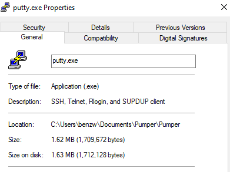
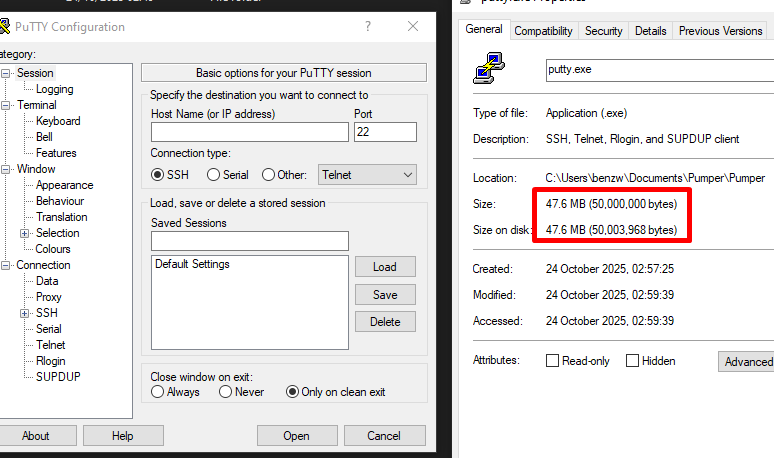

# Pumper: Antivirus Evasion via File Size Padding

## Overview

This project demonstrates a simple yet highly effective technique used to evade antivirus (AV) detection: **padding executable files to exceed AV scan size thresholds**. Many antivirus engines intentionally skip scanning files beyond a certain size (commonly around 650–800 MB), allowing padded files to slip past runtime analysis.

`Pumper` is a proof-of-concept (PoC) utility that artificially increases the size of any file but particularly executable files by appending null or random data, without affecting its functionality. This technique is frequently observed in the wild as a method to bypass basic AV protections (if the file in question is not heavily signatured).

---

## What It Abuses

Most antivirus engines and endpoint protection solutions impose size limits to avoid performance degradation during scans. These limits are often hardcoded or configurable and apply to:
- Cloud submission
- Real-time memory analysis

By inflating a file's size beyond these thresholds, attackers can prevent AVs from even attempting to analyze the file, thereby only having to worry about static detection.

This PoC tool demonstrates how this can be done reliably and at scale.

For additional context, this technique aligns with T1027.001 in the MITRE ATT&CK framework:
- [MITRE ATT&CK: Obfuscated Files or Information - Indicators](https://attack.mitre.org/techniques/T1027/001/)

---

## Technical Details

- Uses `fopen_s` instead of `fopen` for secure file access.
- Uses `BCryptGenRandom` (Windows CNG API) for cryptographically-secure random byte generation.
- Falls back to `rand()` if `BCryptGenRandom` fails.
- Writes data in 4MB chunks to efficiently handle large padding operations.
- Supports files >2GB via `_fseeki64` and `_ftelli64`.
- Ensures data is flushed to disk using `FlushFileBuffers` for reliability.
- Automatically links against `bcrypt.lib` using `#pragma comment(lib, "bcrypt.lib")` for smooth compilation.
- Automatically creates the filename passed in the arguments if it happens to not be detected in the path for demonstration purposes.

---

## Compilation Instructions (Windows)

### Command Line

Using Developer Command Prompt for Visual Studio:

```bash
cl /O2 main.c
```

This will produce `pumper.exe`.

---

## Usage

```bash
pumper.exe <input_file> <target_size_bytes> <mode>
```

### Arguments:
- `<input_file>`: Path to the file to inflate (e.g., `payload.exe`)
- `<target_size_bytes>`: Desired total file size in bytes (e.g., `734003200` for 700MB)
- `<mode>`:
  - `0` = append zero bytes
  - `1` = append random bytes using `BCryptGenRandom`

### Example:

```bash
pumper.exe MoreRam.exe 800000000 1
```

This command will grow `MoreRam.exe` to 800MB using random byte padding. The resulting binary will still function as expected, but may bypass AV runtime scans due to its size.

---

## Demonstration

Two screenshots are included in this repository to show:
- A normal executable before padding
  

  
- The same executable after padding, showing increased size and preserved functionality

  

---

## TODO

- Make pumper cross platform (using /dev/urandom or fseeko64)
- Benchmark performance for various padding sizes (currently only tested to 2 GB)
- Create GUI wrapper for easier usage
- Implement padding with custom byte patterns (e.g., 0xCC, 'NOP sleds')
- Add SHA256 hash logging before/after padding

---

## License

This project is released under the MIT License.

---

## Author

Created and maintained by [@hertzbleed](https://github.com/hertzbleed)

This project serves as an educational resource for researchers, red teamers, and defenders to better understand AV evasion through file size manipulation.
